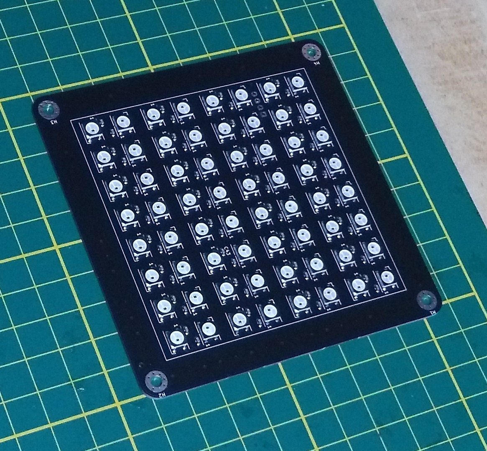
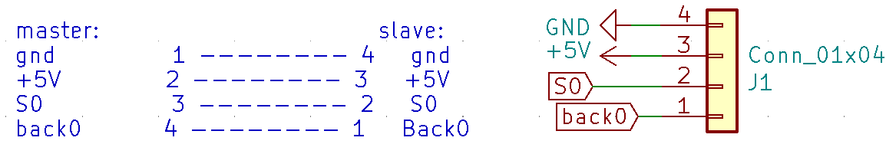
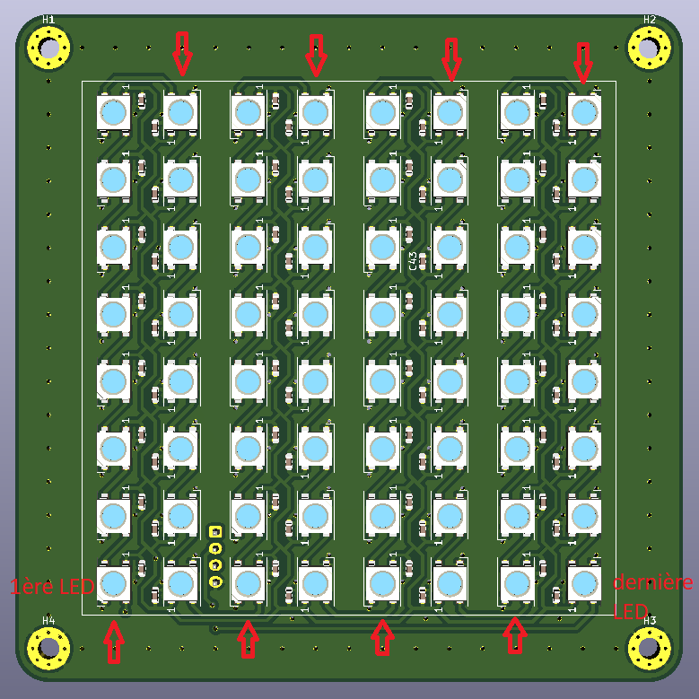

# 04_La_Plaque_LEDS

La_Plaque_LEDS est constituée de 64 leds RGB WS2812B, toutes en série, constituant une "matrice" de 8 * 8 leds.

Ces LEDS sont plus connues comme "NEOPIXELS". Les bibliothèques logicielles, comme celle d'Adafruit par exemple, permettent de les piloter facilement.

La licence est celle du CERN Open Hardware Licence version 2; CERN-OHL-P ; permissive.
Le fichier de cette license est présent dans le répertoire: cern_ohl_p_v2.txt

## Photos

Ci-joint la photo de la version de 2020_12_06 // Here picture of version 2020_12_06:

## Connection et fonctionnement

Ci-joint le schéma du connecteur du module de la version de 2020_12_06

Le module fonctionne de la façon suivante:
Il faut l'alimenter avec une tension comprise entre 3.7V et 5.3V sur la pin +5V. Une tension comme celle de l'USB classique convient parfaitement. (Ne pas oublier GND bien sûr).

La pin S0 permet de communiquer avec la première LED, en attaquant la pin "Din" de la LED.

La pin back0 permet de récupérer le signal sortant "Dout" de la LED.

[Plus d'informations sur le site de Worldsemi](http://www.world-semi.com/ "http://www.world-semi.com")

Les LEDS sont réparties de la façon suivante:

